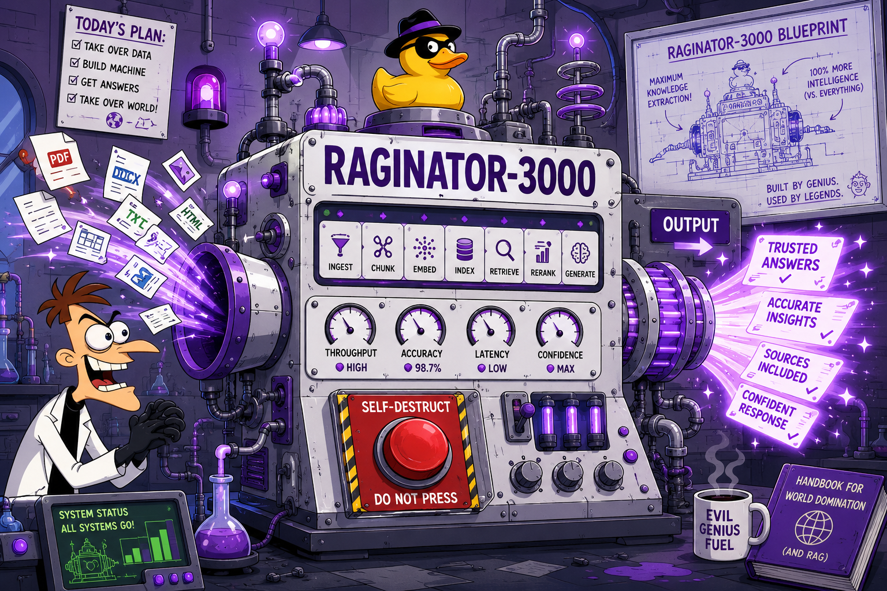
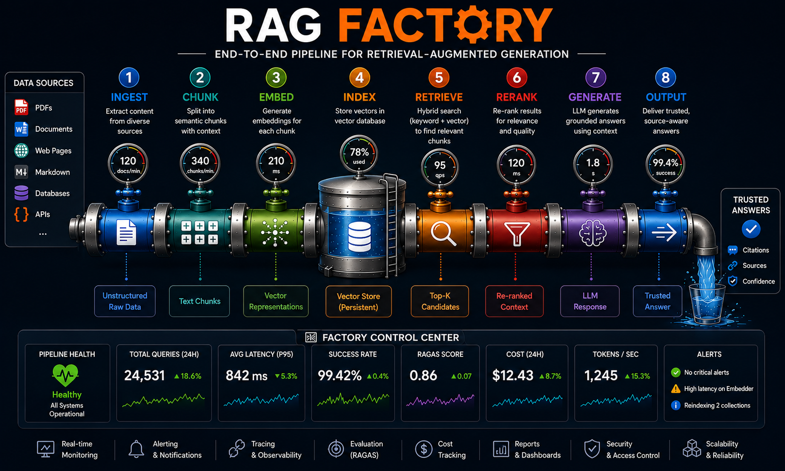

# RAG FACTORY 🦆
> Transforms chaotic PDFs, docs, websites, and APIs into trusted answers using embeddings, retrieval, reranking, and LLMs.


### Powered by the **Raginator-3000**

```python
            ┌─────────────────────────────────────┐
            │  RAGINATOR — TRI-STATE RAG MACHINE  │
            │  Patent Pending — Doofenshmirtz Inc │
            └─────────────────────────────────────┘

            "Behold! The RAGINATOR!"
             Point it at ANY data source and it shall RAG-ify everything in the tri-state area!
                                                                    — Dr. Doofenshmirtz, probably
```




## See also
- [Model Gym](https://github.com/HiteshSahu/Model-Gym) — 
  optimize and benchmark the model that powers your RAG pipeline
- Raginator — build the pipeline around it

## RAG PIPELINE



### Stages

| Stage | Normal Name       | Raginator Name             | Job                                              |
|-------|-------------------|----------------------------|--------------------------------------------------|
| 0     | Ingest 📚         | **The Suck-Inator**        | Vacuums up PDFs, websites, docs, and APIs.       |
| 1     | Chunk 📑          | **The Chunk-Inator**       | Slices knowledge into chunks.                    |
| 2     | Embed 🔢          | **The Embed-Inator**       | Converts chunks into embeddings.                 |
| 3     | Store / Index ↗️  | **The Store-Inator**       | Stores everything for future evil use.           |
| 4     | Retrieve 🐕         | **The Find-Inator**        | Retrieves relevant context.                      |
| 5     | Rerank 🔀           | **The Better-Find-Inator** | Decides which context is actually useful.        |
| 6     | Generate 🧠         | **The Answer-Inator**      | Generates a response.                            |
| 7     | Evaluate 📋         | **The Evaluate-Inator**    | judges its own work.                             |
| 8     | Observe 📊          | **The Observe-Inator**     | Monitors the entire operation from headquarters. |


---

## 📂 Project Layout

```text
RAG-Factory/
├── raginator/                  # the raginator package, organized one folder per stage
│   ├── core/                    # shared abstract interfaces
│   │   └── src/base.py          # __init__.py + base.py live directly in src/
│   ├── ingest/                  # Stage 0, The Suck-Inator
│   ├── chunk/                   # Stage 1, The Chunk-Inator
│   ├── embed/                   # Stage 2, The Embed-Inator
│   ├── store/                   # Stage 3, The Store-Inator
│   ├── retrieve/                # Stage 4, The Find-Inator
│   ├── rerank/                  # Stage 5, The Better-Find-Inator
│   ├── generate/                # Stage 6, The Answer-Inator
│   ├── evaluate/                # Stage 7, The Evaluate-Inator
│   ├── observe/                 # Stage 8, The Observe-Inator
│   └── pipeline/                # orchestrator wiring all 9 stages together
│       (each raginator/<stage>/ has a flat src/ — no redundant nested
│        raginator/<stage>/ folder inside it — plus its own tests/. The
│        single root pyproject.toml maps each dotted import name to its
│        stage's src/ directly, e.g.:
│          [tool.setuptools.package-dir]
│          "raginator.chunk" = "raginator/chunk/src")
├── native/                      # optional C++/CUDA acceleration (own CMake build)
│   ├── CMakeLists.txt           # USE_CUDA=OFF by default (builds CPU-only)
│   ├── include/similarity.hpp
│   ├── src/similarity.cpp       # CPU cosine similarity
│   ├── src/similarity_cuda.cu   # CUDA kernel (built when -DUSE_CUDA=ON)
│   └── bindings/bindings.cpp    # pybind11 module: raginator_native
├── docker-compose.yml            # Prometheus + Grafana, brought up by `./go observe`
├── docker/
│   ├── prometheus.yml            # scrapes host.docker.internal:8000 (the metrics server)
│   └── grafana/provisioning/     # auto-loads raginator/observe/dashboards/raginator.json
├── go                            # CLI entrypoint — ./go install | dev | test | ...
├── scripts/
│   ├── demo.py                   # toy pipeline run by `./go demo`
│   └── metrics_server.py         # toy pipeline on a loop, exposing :8000/metrics
├── img/
├── pyproject.toml                # the one and only project file: deps, extras, ruff/mypy/pytest
├── LICENSE
└── README.md
```

It's a single distribution (`raginator`) with one pip extra per stage, just
gating that stage's third-party deps (e.g. `embed`/`store` need numpy) — all
the code always ships together, organized by folder for readability and so a
team can own a stage's `raginator/<stage>/` folder day to day.


---

### `./go` CLI

Open Interactive CLI
> ./go                      # interactive command menu


### Install dependnecies
```bash
./go install_tools        # create .venv, upgrade pip
./go install              # editable-install raginator[dev] (every stage + pytest/ruff/mypy)
./go install chunk        # editable-install just raginator[chunk]
```

### Run Pipeline

```bash
./go dev                  # install everything, then run the toy pipeline once
./go demo                 # run the toy pipeline against sample text (no install)
```

The pipeline runs end-to-end with pure-Python/numpy defaults (no GPU, no
model downloads). 

### Build CPP
```bash
./go build_native         # CMake build raginator_native (CPU by default)
./go build_native --cuda. # CMake build raginator_native (CPU by default)
```

`./go build_native` builds the optional C++/CUDA extension
used by the store stage; if it isn't built, `InMemoryVectorStore`
transparently falls back to a numpy implementation of the same similarity
scoring.

### Observability
```bash
./go metrics_server       # run the toy pipeline on a loop, exposing :8000/metrics
./go observe               # docker/podman compose up Prometheus+Grafana, open the dashboard
```

`./go observe` Brings up Prometheus and Grafana (`docker compose`, falling
back to `podman compose` if `docker` isn't installed), waits for Grafana's
health check, then opens the **raginator-3000** dashboard in the browser.

Grafana auto-provisions the Prometheus datasource and loads `raginator/observe/dashboards/raginator.json` — no manual setup. It's a
local-only stack (anonymous admin auth, so the dashboard opens with no
login prompt);

run `./go metrics_server` alongside it in another shell so
the panels have live data to show instead of "No data".

### Test 
```bash
./go test [stage]         # pytest, across everything or one stage
./go lint                 # ruff check
./go typecheck            # mypy, run per stage (see note below)
./go check                # lint + typecheck + test
```


> **Note:** `./go typecheck` runs mypy once per stage rather than once for
> the whole tree. Every stage's source dir is named plain `src` (that's the
> flattening above), and mypy infers a module's dotted name purely from
> nested `__init__.py` directories on disk — checking them all in one mypy
> invocation hits "Duplicate module named src". Per-stage invocation avoids
> that; it's also what made cross-package types resolve correctly (mypy now
> picks up `raginator.core` from the actual installed environment instead
> of trying to triangulate it from a single package's isolated search path).


```bash
./go clean                # remove .venv, native/build, caches
```

Equivalently, the same selection is available as plain pip extras:

```bash
pip install -e ".[all]"     # every stage + the orchestrator
pip install -e ".[chunk]"   # just Stage 1's deps (chunk has none beyond core)
pip install -e ".[dev]"     # all stages + pytest, ruff, mypy
```

Each stage's tests also run independently, e.g. `pytest raginator/chunk/tests`.


---

*© 2026 [Hitesh Kumar Sahu](https://hiteshsahu.com) · Licensed under [Apache 2.0](https://www.apache.org/licenses/LICENSE-2.0)*

